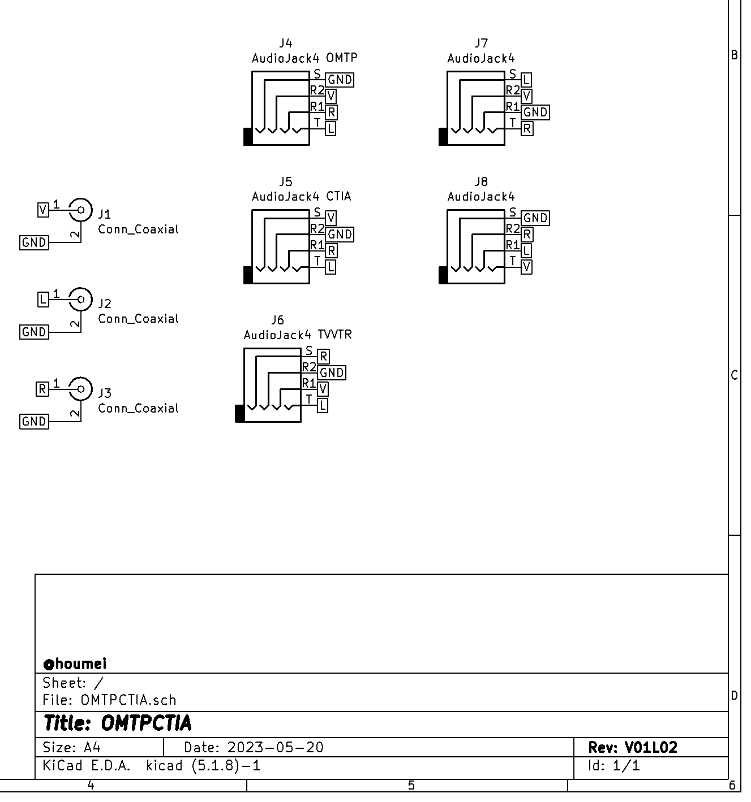
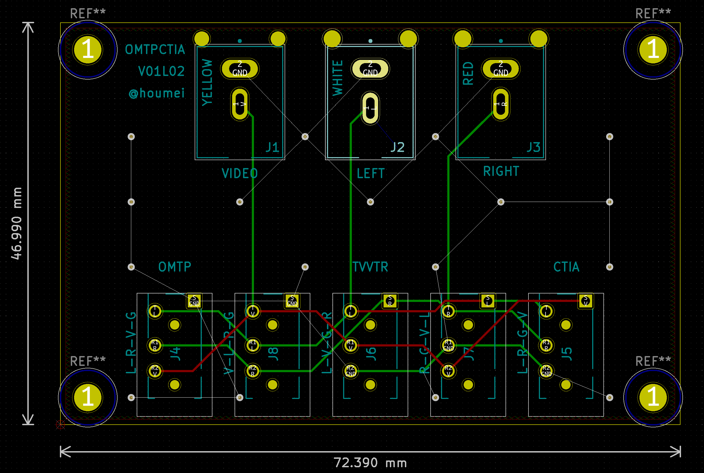

# OMTPCPIA and other TRRS plug converter (KiCad5)

Schematic

PCB

部品表  

J1 [基板用RCAジャック 黄 RJ-2410](https://akizukidenshi.com/catalog/g/gC-06508/)  
J2 [基板用RCAジャック 白 MJ-523](https://akizukidenshi.com/catalog/g/gC-16497/)  
J3 [基板用RCAジャック 赤 RJ-2410](https://akizukidenshi.com/catalog/g/gC-02385/)  
J5-J8 [３．５ｍｍ４極ミニジャック　基板取付用　ＭＪ－４ＰＰ－９](https://akizukidenshi.com/catalog/g/gC-06070/)  

## 説明

[OMTPCTIA 4極3.5mmジャックの変換基板](http://blog.livedoor.jp/hardyboy/archives/10368279.html)  

## 履歴
V01L01(非公開) 初版 RCAジャック、4極3.5mmジャックのフットプリント要改善  
V01L02 フットプリントのみ差し替え  

## OMTPCTIAV01L02GB - Gerber
JLCPCBなどにそのまま出図可能です。  
